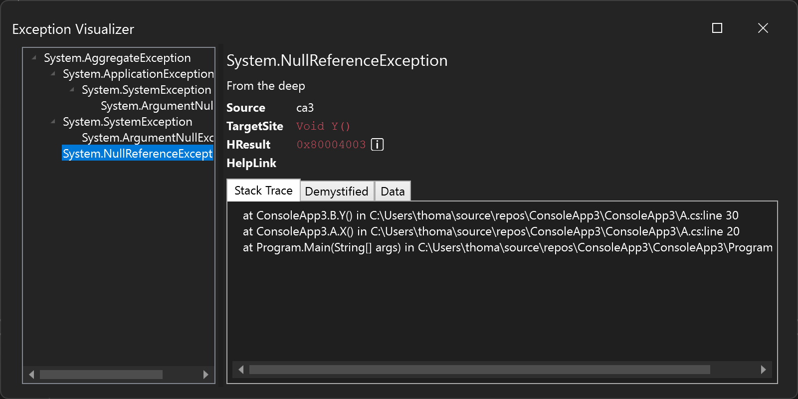
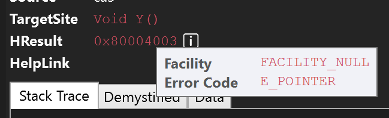
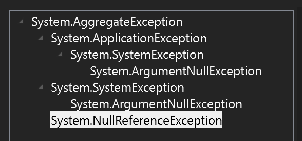

#  Exception Visualizer  

Exception Debug Visualizer for Visual Studio.

When debugging applications and an exception is thrown you can view the exception details in a more structured and visually pleasing form:

The popup offers a range of features like parsing of HResults:

Aggreate and inner exceptions are nested in the left side of the screen:

The Exception Visualizer can be opened from the *Locals* or *QuickView* windows by clicking *View* next to the exception:

## Updating

I'm suspecting there's a bug in Visual Studio when trying to update extensions based on the new extensions system. The bug will cause the Visual Studio Updater to report that there are no available updates when trying to update to a new Exception Visualizer version.

To correctly update this extension from a previous version, you can follow these steps:

1. Launch Visual Studio Installer.
2. Click 'Modify' on your Visual Studio version.
3. Go to the Individual components tab.
4. Search for 'exception'.
5. Uncheck the 'Exception Visualizer' (might have a different name if you have an older version).
6. Click 'Modify'
7. Then install the extension from scratch.

---

Sponsored by [elmah.io](https://elmah.io).
